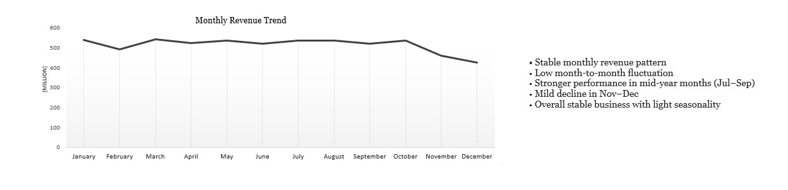
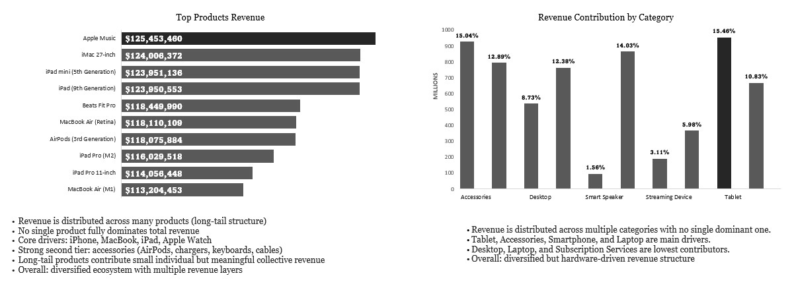

# 🍏 Apple Sales Performance Dashboard (Excel BI Project)

## 📌 Overview
This project is an interactive Excel-based dashboard designed to analyze Apple sales performance across products, categories, and countries.

The goal was to transform raw transactional data into actionable insights using a full end-to-end BI workflow.

---

## 🛠 Tools Used
- Microsoft Excel
- Power Query
- Pivot Tables & Pivot Charts
- Data Modeling
- Slicers

---

## 📊 Dashboard Features
- Monthly revenue trend analysis
- Product performance breakdown
- Category-level insights
- Geographic revenue distribution
- Interactive filtering (Slicers)

---

## 📈 KPIs
- Total Revenue
- Total Quantity Sold
- Total Transactions
- Average Order Value

---

## 🧠 Key Insights
- Revenue follows a long-tail structure with no single dominant product.
- Core drivers include iPhone, MacBook, and iPad.
- Revenue is diversified across categories.
- The US is the top market (~19% contribution).
- Monthly revenue shows a stable upward trend.

---

## 📷 Dashboard Preview

### KPIs
![KPIs]KPI Cards.jpg

### Revenue Analysis

### Product/Category Analysis

### Geography

---

## ⚠️ Data Note
The dataset was structured for BI practice purposes and simulates real-world sales behavior.

---

## 🚀 Skills Demonstrated
- Data Cleaning & Transformation
- Data Modeling
- KPI Design
- Dashboard Development
- Business Storytelling
